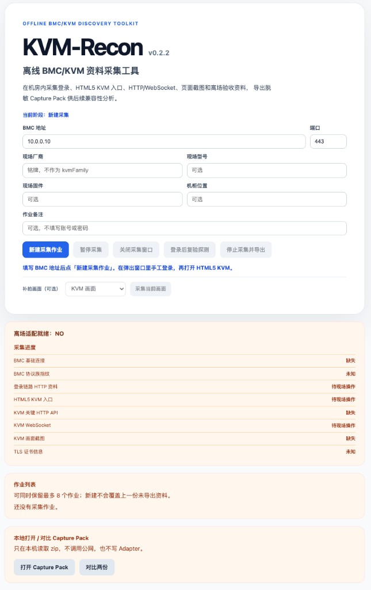

# KVM-Recon

**English** | [简体中文](README.zh-CN.md)

[](https://github.com/zzugbb/KVM-Recon/actions/workflows/ci.yml)
[](LICENSE)
[](https://github.com/zzugbb/KVM-Recon/releases)

Offline BMC/KVM Discovery & Compatibility Toolkit.

KVM-Recon is an offline desktop client for the server room: it records what happens when you log into a BMC, open HTML5 KVM, and establish the related HTTP/WebSocket traffic, then exports a redacted Capture Pack. After you leave the room and get a network connection, give that pack to an engineer or an AI for gateway compatibility analysis.

The in-app UI and the field guide are currently Chinese. This README is the English entry for GitHub visitors.

## Screenshots



## What this project is

- An offline capture tool. It is **not** a production KVM gateway and does not provide a remote console for operators.
- It does not need the public internet and does not call external analysis services inside the server room.
- On-site staff can help log in, click menus, and open HTML5 KVM; the tool records the facts needed for later adaptation.
- This tool **does not write adapters**.

The primary key is `kvmFamily` (`ami-megarac` / `openbmc-h5` / `huawei-ibmc` / `unknown-h5` / `not-h5`), not a vendor logo or model string. Nameplate fields (vendor / product / firmware / location) are evidence only.

## Download

Get macOS and Windows installers from [GitHub Releases](https://github.com/zzugbb/KVM-Recon/releases) and check `SHA256SUMS.txt`. Maintainer release steps are in `docs/releasing.md`.

Current builds **do not use paid Apple / Microsoft developer certificates**:

- **macOS**: ad-hoc signature. If Gatekeeper says the developer cannot be verified after a browser download, allow it in **System Settings → Privacy & Security**.
- **Windows**: no Authenticode signature. If SmartScreen says Windows protected your PC or the publisher is unknown, choose **More info → Run anyway**.

Step-by-step field instructions (Chinese) are in `docs/offline-field-guide.md`.

## Field workflow

1. Install and open KVM-Recon in the server room.
2. Enter the BMC address and port; optionally fill in on-site vendor, product, firmware, rack location, and a job note.
3. Start capture. The tool runs basic probes plus TLS/fingerprint collection.
4. An embedded browser opens the BMC. On-site staff **manually** log in if needed.
5. Open the HTML5 KVM entry and wait for the viewer and WebSocket. If KVM opens in a new window, keep that window in the foreground for at least 10 seconds.
6. The tool records HTTP, WebSocket, page events, screenshots, storage keys, TLS, fingerprints, and the checklist.
7. Export a Capture Pack. After leaving the room, read `artifacts/handover.md` inside the pack.

The main window shows the current tool version (`vX.Y.Z`), matching `manifest.tool.version` in the exported pack.

## Development

Requires Node.js 22+.

```bash
npm ci
npm run typecheck
npm test
npm run build
npm run test:e2e
npm run dev
```

- `npm test`: unit tests plus a local mock-BMC probe / redaction / zip loop
- `npm run test:e2e`: launches the Electron main window, then exits after a successful load (build first)
- `npm run package:mac` / `npm run package:win`: local installers; tagged `v*` releases are documented in `docs/releasing.md`

## Docs

Index: `docs/README.md`.

- `docs/offline-field-guide.md`: install and capture on site (Chinese)
- `docs/capture-pack-spec.md`: Capture Pack contract
- `docs/releasing.md`: build and publish installers
- `docs/development-plan.md`: staged plan and product boundary
- `docs/mvp-architecture.md`: technical architecture
- `schema/`: JSON Schema for pack files (timeline, TLS, probes, and more)
- `CHANGELOG.md`: version history; fold `[Unreleased]` into a version heading when you ship
- `CONTRIBUTING.md`, `CODE_OF_CONDUCT.md`, `SECURITY.md`, `LICENSE`

## Safety and limits

- No plaintext passwords, no cookie values on disk, no full KVM video bitstream.
- Will not: auto-login, MITM, call AI inside the server room, auto-write adapters, or fully decode video.
- Report vulnerabilities via [Security Advisories](https://github.com/zzugbb/KVM-Recon/security/advisories/new). Do not paste credentials or unredacted capture packs into issues.

## License

[MIT](LICENSE)
